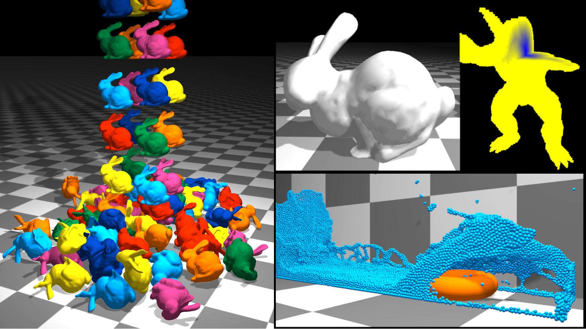

# Unified Physics Simulation of Variable Sized Particles Generated on Demand

This is my Master's project in 2017 ([`thesis.pdf`](data/master_thesis.pdf)), which is based on the position-based unified dynamic framework presented by Macklin et al [^1].
In this project, I removed the restriction of fixed radius of the particles in the same scene entailed by the aforementioned unified framework to reduce memory footprint of the physics simulation while maintaining the real-time performance (60+ fps on RTX 1060 Mobile). 

More specifically, large particles are used for the inner part of rigid bodies and (moderately) deformable objects, while keeping their surfaces fine grained. Our GPU algorithms for particle generation and SDF computation enables the generation of a large number of differently sized particles on the fly, which allows for dynamically modifying the scene without the need for storing potentially huge amount of precomputed particle and SDF data.

For efficient collision detection between differently sized particles and generation of density constraints for fluids, I implemented BVH (Bounding Volume Hierarchy) construction and traversal on the GPU. 

Originally the project was implemented with C++, OpenGL 4 and CUDA 8 using VS 2017. Ever since CMake support for CUDA has been improved dramatically. Recently I refactored and improved the CMake scripts so that it can be compiled with VS 2019 and CUDA 11. 

[^1]: Macklin, Miles, et al. "Unified particle physics for real-time applications." ACM Transactions on Graphics (TOG) 33.4 (2014): 1-12.
